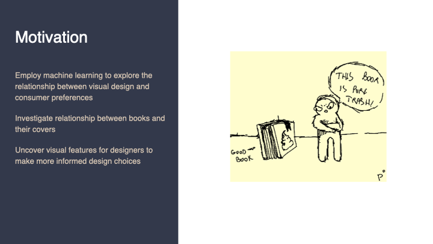
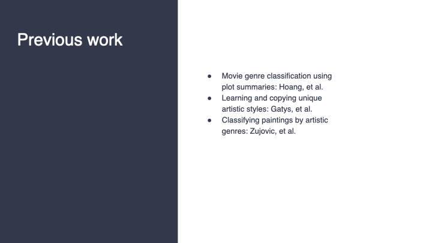
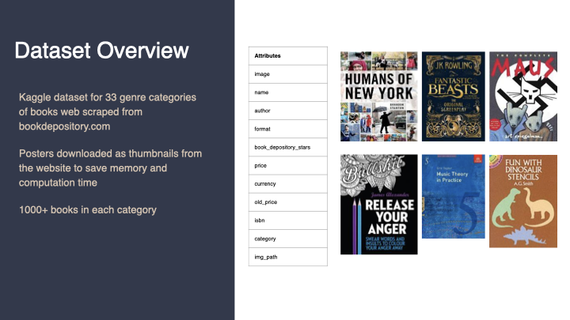
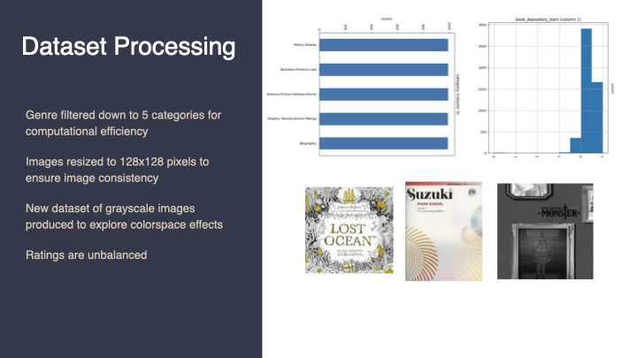
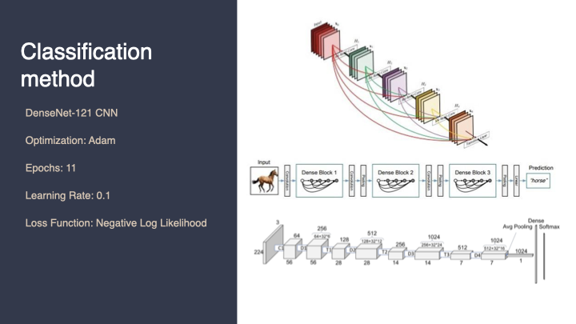
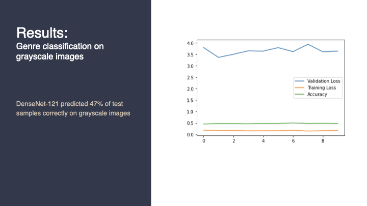
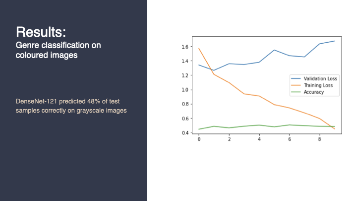
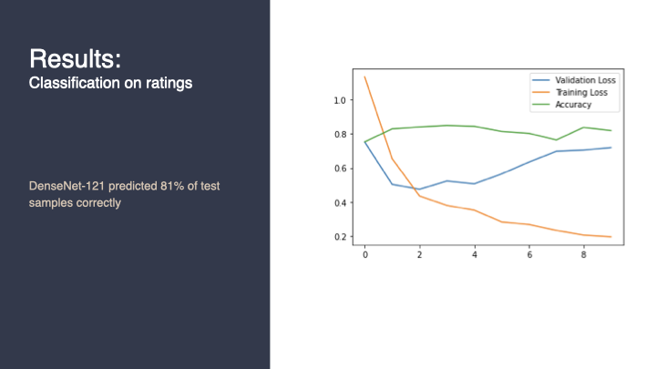
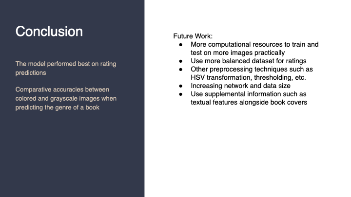

# Book-Genre-Predictor

---

---

---

------

------

------

These algorithms have convolution layers, pooling layers and fully-connected layers. Traditional CNN’s have X layers with X connections, one between each layer and its subsequent layer, while DenseNet-121 has X(X+1)/2 connections. By using DenseNets we can ensure maximum information (and gradient) flow. To do it, we simply connect every layer directly with each other. These extra connections give us a number of advantages:

Alleviation of the vanishing gradient problem
Strengthened feature propagation
Encourage feature reuse and reduce the number of parameters
Each layer has direct access to the gradients from the loss function

------

Our model achieved an accuracy of 0.47 on the greyscale testing set with five genres. From the figure, it appears that the model is underfitting the data because the validation losses don’t converge to the training losses.

------

On the RGB training and test sets, the model performed similarly, achieving an accuracy of 0.48, but with lower training losses than the greyscale

------

Since the processing of images as RGB or grayscale did not greatly improve accuracy, we chose to use grayscale posters to predict book ratings. The results for the training and testing of the ratings is shown in the figure. The model attained an accuracy of 0.81 on predicting the rating of a book.

------

------
